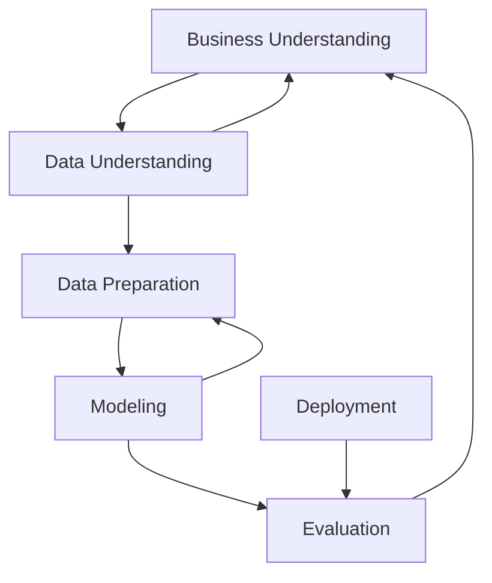

# Data Science Methodology

<!-- TOC tocDepth:2..3 chapterDepth:2..6 -->

- [Terminology](#terminology)
    - [CRISP - DM](#crisp---dm)

<!-- /TOC -->

## Terminology

### CRISP - DM
*Cross-Industry Standard Process for Data Mining*

> You'll continue the CRISP-DM process until the data model and its analysis answer the business questions