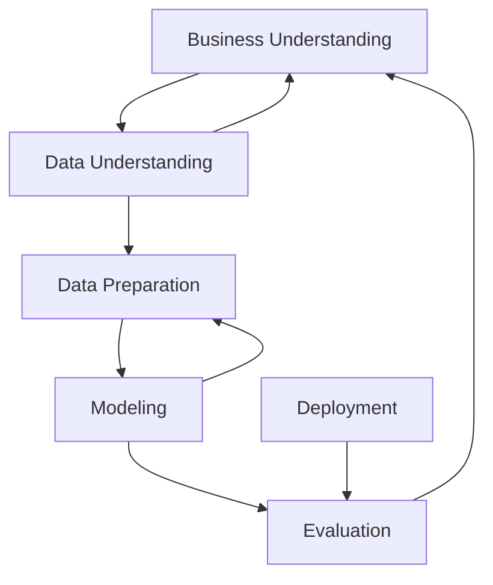

# Data Science Methodology

<!-- TOC tocDepth:2..3 chapterDepth:2..6 -->

- [Terminology](#terminology)
    - [CRISP - DM](#crisp---dm)

<!-- /TOC -->

## Terminology

| Term | Definition |
| --- | --- |
| Analytic Approach | The process of selecting the appropriate method or path to address a specific data science question or problem. |
| Analytics | 	The systematic analysis of data using statistical, mathematical, and computational techniques to uncover insights, patterns, and trends.
| Business Understanding | 	The initial phase of data science methodology involves seeking clarification and understanding the goals, objectives, and requirements of a given task or problem.
| Clustering Association | 	An approach used to learn about human behavior and identify patterns and associations in data.
| Cohort | 	A group of individuals who share a common characteristic or experience is studied or analyzed as a unit.
| Cohort study |An observational study where a group of individuals with a specific characteristic or exposure is followed over time to determine the incidence of outcomes or the relationship between exposures and outcomes.
| Congestive Heart Failure (CHF) | 	A chronic condition in which the heart cannot pump enough blood to meet the body's needs, resulting in fluid buildup and symptoms such as shortness of breath and fatigue.
| CRISP-DM | 	Cross-Industry Standard Process for Data Mining is a widely used methodology for data mining and analytics projects encompassing six phases: business understanding, data understanding, data preparation, modeling, evaluation, and deployment.
| Data analysis | 	The process of inspecting, cleaning, transforming, and modeling data to discover useful information, draw conclusions, and support decision-making.
| Data cleansing | 	The process of identifying and correcting or removing errors, inconsistencies, or inaccuracies in a dataset to improve its quality and reliability
| Data science | 	An interdisciplinary field that combines scientific methods, processes, algorithms, and systems to extract knowledge and insights from structured and unstructured data.
| Data science methodology | 	A structured approach to solving business problems using data analysis and data-driven insights.
| Data scientist | 	A professional using scientific methods, algorithms, and tools to analyze data, extract insights, and develop models or solutions to complex business problems.
| Data scientists | 	Professionals with data science and analytics expertise who apply their skills to solve business problems.
| Data-Driven Insights | 	Insights derived from analyzing and interpreting data to inform decision-making
| Decision tree | 	A supervised machine learning algorithm that uses a tree-like structure of decisions and their possible consequences to make predictions or classify instances.
| Decision Tree Classification Model | 	A model that uses a tree-like structure to classify data based on conditions and thresholds provides predicted outcomes and associated probabilities.
| Decision Tree Classifier | 	A classification model that uses a decision tree to determine outcomes based on specific conditions and thresholds.
| Decision-Tree Model | 	A model used to review scenarios and identify relationships in data, such as the reasons for patient readmissions
| Descriptive approach | 	An approach used to show relationships and identify clusters of similar activities based on events and preferences
| Descriptive modeling | 	Modeling technique that focuses on describing and summarizing data, often through statistical analysis and visualization, without making predictions or inferences
| Domain knowledge | 	Expertise and understanding of a specific subject area or field, including its concepts, principles, and relevant data
| Goals and objectives | 	The sought-after outcomes and specific objectives that support the overall goal of the task or problem.
| Iteration |	A single cycle or repetition of a process often involves refining or modifying a solution based on feedback or new information.
| Iterative process | 	A process that involves repeating a series of steps or actions to refine and improve a solution or analysis. Each iteration builds upon the previous one.
| Leaf | 	The final nodes of a decision tree where data is categorized into specific outcomes.
| Machine Learning | 	A field of study that enables computers to learn from data without being explicitly programmed, identifying hidden relationships and trends.
| Mean | 	The average value of a set of numbers is calculated by summing all the values and dividing by the total number of values.
| Median | 	When arranged in ascending or descending order, the middle value in a set of numbers divides the data into two equal halves.
| Model (Conceptual model) | 	A simplified representation or abstraction of a real-world system or phenomenon used to understand, analyze, or predict its behavior.
| Model building | 	The process of developing predictive models to gain insights and make informed decisions based on data analysis.
| Pairwise comparison (correlation) | 	A statistical technique that measures the strength and direction of the linear relationship between two variables by calculating a correlation coefficient.
| Pattern | 	A recurring or noticeable arrangement or sequence in data can provide insights or be used for prediction or classification.
| Predictive model |	A model used to determine probabilities of an action or outcome based on historical data.
| Predictors |	Variables or features in a model that are used to predict or explain the outcome variable or target variable.
| Prioritization |	The process of organizing objectives and tasks based on their importance and impact on the overall goal.
| Problem solving |	The process of addressing challenges and finding solutions to achieve desired outcomes.
| Stakeholders |	Individuals or groups with a vested interest in the data science model's outcome and its practical application, such as solution owners, marketing, application developers, and IT administration.
| Standard deviation |	A measure of the dispersion or variability of a set of values from their mean; It provides information about the spread or distribution of the data.
| Statistical analysis |	Stand deviations are applied to problems that require counts, such as yes/no answers or classification tasks.
| Statistics |	The collection, analysis, interpretation, presentation, and organization of data to understand patterns, relationships, and variability in the data.
| Structured data (data model) |	Data organized and formatted according to a predefined schema or model and is typically stored in databases or spreadsheets.
| Text analysis data mining |	The process of extracting useful information or knowledge from unstructured textual data through techniques such as natural language processing, text mining, and sentiment analysis.
| Threshold value |	The specific value used to split data into groups or categories in a decision tree.

### CRISP - DM
*Cross-Industry Standard Process for Data Mining*

> You'll continue the CRISP-DM process until the data model and its analysis answer the business questions